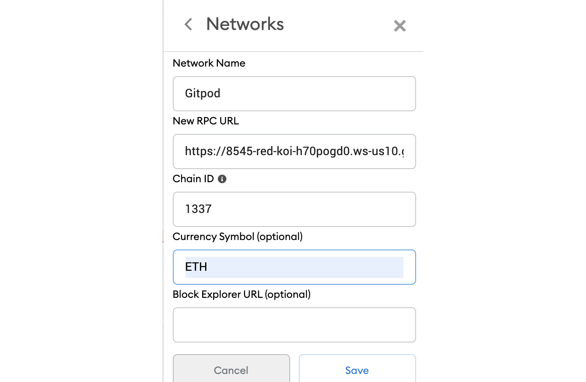

## Full stack NFT marketplace built with Polygon, Solidity, IPFS, & Next.js


This is the codebase to go along with tbe blog post [Building a Full Stack NFT Marketplace on Ethereum with Polygon](https://dev.to/dabit3/building-scalable-full-stack-apps-on-ethereum-with-polygon-2cfb)

### Running this project

#### Gitpod

To deploy this project to Gitpod, follow these steps:

1. Click this link to deploy

[](https://gitpod.io/#github.com/dabit3/polygon-ethereum-nextjs-marketplace)

2. Import the RPC address given to you by GitPod into your MetaMask wallet

This endpoint will look something like this:

```
https://8545-copper-swordtail-j1mvhxv3.ws-eu18.gitpod.io/
```

The chain ID should be 1337. If you have a localhost rpc set up, you may need to overwrite it.



#### Local setup

To run this project locally, follow these steps.

1. Clone the project locally, change into the directory, and install the dependencies:

```sh
git clone https://github.com/dabit3/polygon-ethereum-nextjs-marketplace.git

cd polygon-ethereum-nextjs-marketplace

# install using NPM or Yarn
npm install

# or

yarn
```

2. Start the local Hardhat node

```sh
npx hardhat node
```

3. With the network running, deploy the contracts to the local network in a separate terminal window

```sh
npx hardhat run scripts/deploy.js --network localhost
```

4. Start the app

```
npm run dev
```

### Configuration

To deploy to Polygon test or main networks, update the configurations located in __hardhat.config.js__ to use a private key and, optionally, deploy to a private RPC like Infura.

```javascript
require("@nomiclabs/hardhat-waffle");
const fs = require('fs');
const privateKey = fs.readFileSync(".secret").toString().trim() || "01234567890123456789";

// infuraId is optional if you are using Infura RPC
const infuraId = fs.readFileSync(".infuraid").toString().trim() || "";

module.exports = {
  defaultNetwork: "hardhat",
  networks: {
    hardhat: {
      chainId: 1337
    },
    mumbai: {
      // Infura
      // url: `https://polygon-mumbai.infura.io/v3/${infuraId}`
      url: "https://rpc-mumbai.matic.today",
      accounts: [privateKey]
    },
    matic: {
      // Infura
      // url: `https://polygon-mainnet.infura.io/v3/${infuraId}`,
      url: "https://rpc-mainnet.maticvigil.com",
      accounts: [privateKey]
    }
  },
  solidity: {
    version: "0.8.4",
    settings: {
      optimizer: {
        enabled: true,
        runs: 200
      }
    }
  }
};
```

If using Infura, update __.infuraid__ with your [Infura](https://infura.io/) project ID.
